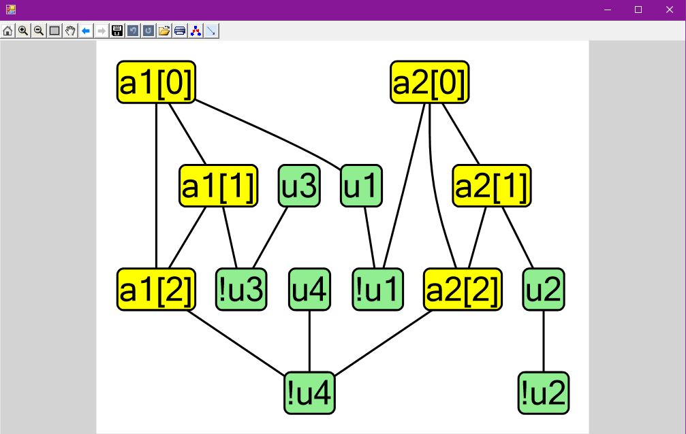
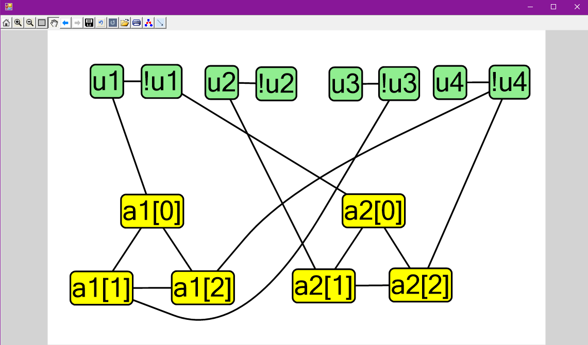

# Funcionamiento

El fichero **VertexCover.exe** es un ejecutable de la práctica del módulo 2.

Se trata de un fichero .exe que debe ser ejecutado en la consola y que recibe un parametro por line de comandos. Su ejecución es tal que:

```
./VertexCover.exe file.sat3
```
#### Notas importantes
* Para que la ejecución funcione correctamente, el archivo debe encontrarse en la misma carpeta que todos los dll con los que va acompañado.
* El archivo ejecutable se encuentra dentro de la ruta ```VertexCover/VertexCover/bin/Debug```

Dentro de la carpeta Examples, se encuentran tres ejemplos de prueba.

Una vez abierto el programa, aparecerá el grafo del vertex cover directamente creado. El único inconveniente es que al principio nos daremos cuenta que no tiene mucho sentido, pero no hay que alarmarse, los nodos se pueden mover. Por ejemplo, para el primer ejemplo la interfaz nos mostraría algo tal que asi:



Mientras que si lo movemos con el ratón a lo que estamos acostumbrados quedaría exactamente como mejor lo entendemos:



Además la interfaz generada nos permite guardar y cargar los diferentes grafos y modificarlos sin ningún problema.

# Instancias del 3-SAT

Para crear una instancia del 3-SAT, debemos crear un fichero con la extensión **.sat3**. El fichero deberá contener lo siguiente:

1. El número de literales.
2. El conjunto de literales del problema (un literal por línea).
3. Las cláusulas del problema (una cláusula por línea).

Ejemplo:

```
4
u1
u2
u3
u4
u1 !u3 !u4
!u1 u2 !u4
```
